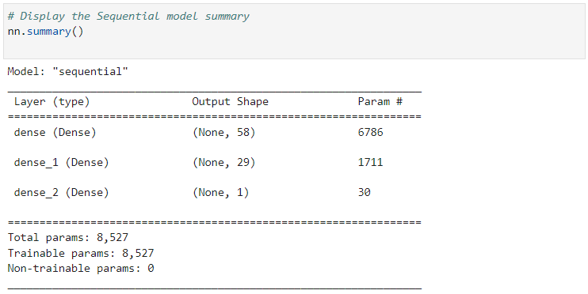
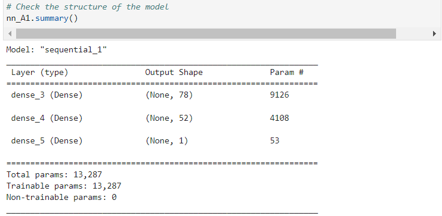
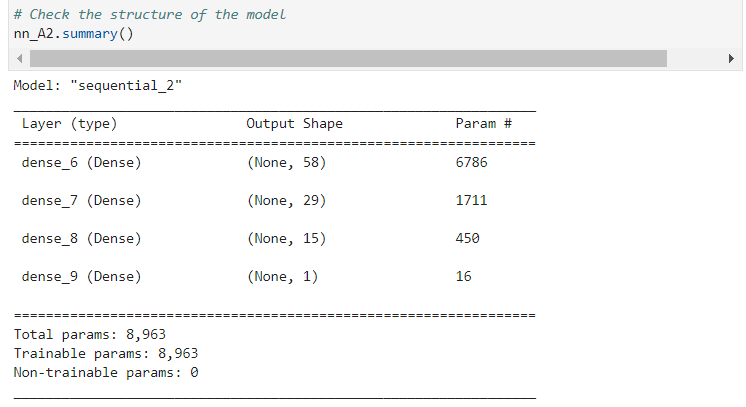
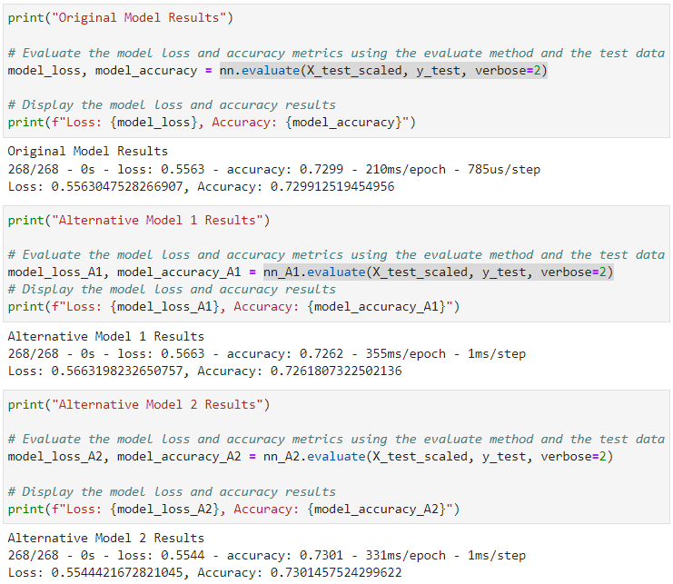

# Venture-Funding-with-Deep-Learning
## Summary
I am building a model that predicts whether applicants will be successful if funded by Alphabet Soup, a venture capital firm. 
The business team has given me a CSV containing more than 34,000 organizations that have received funding from Alphabet Soup over the years. With my knowledge of machine learning and neural networks, I use the features in the provided dataset to create a binary classifier model that will predict whether an applicant will become a successful business.

I went through the following steps:

1. Prepare the Data for Use on a Neural Network Model¶
    - I imported the data, dropped the unnecessary columns, encoded the categorical variables in the data with `OneHotEncoder`, and concatenated the encoded data with the numerical variables from the original DataFrame.
    - I splited the the features and target sets into training and testing datasets using `train_test_split`.
    - Then I used scikit-learn's `StandardScaler` to scale the features data.
2. Compile and Evaluate a Binary Classification Model Using a Neural Network
    - I first created a deep neural network by assigning the number of input features, the number of layers, and the number of neurons on each layer using `Tensorflow’s Keras`.
    
    - I then compiled and fit the model using the `binary_crossentropy` loss function, the `adam` optimizer, and the `accuracy` evaluation metric.
    - I then evaludated the model using the test data to determine the model’s loss and accuracy. This model's loss is around 55.6%, and its accuracy score is around 72.9%. 
    - I saved and exported my model to an HDF5 file.
3. Optimize the Neural Network Model
    - I repeated the steps beforehand, and defined another two new deep neural network models to improve on my first model’s predictive accuracy.
    - Alternative Model 1: Based on the original deep neural network model, I have increased the number of hidden nodes for the first hidden layer from 58 to 78, increased the the number of hidden nodes for the second hidden layer from 29 to 52, increased the number of epochs from 50 to 100. Alternative Model 1's loss is around 56.6%, and its accuracy score is around 72.6%. 
    
    - Alternative Model 2: Based on the original deep neural network model, I have increased the number of hidden layers from 2 to 3. And the number of hidden nodes for the third hidden layer is 15. I have also changed the activation function of the hidden layers from relu to tanh. Alternative Model 2's loss is around 55.4%, and its accuracy score is around 73.0%. 
    

By adding the number of layers and changing the activation function of the hidden layers, the accuracy score of the model has improved. 

## Skills
- Tensorflow
- Keras
- Sklearn: train_test_split, StandardScaler, OneHotEncoder
- Pandas
- Python
- Neural networks
- Deep learning 

## Implementation
By using different deep neural network models, we can predict how likely the businesses can succeed. By twisitng the structure of the deep neural network model, we can potentially achieve higher accuacy of predicting the correct outcome of the business. As a result, we will be able to invest in the businesses that are predicted to be more likely to succeed, and improve the return on our investment.